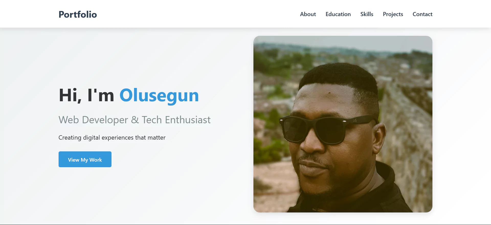
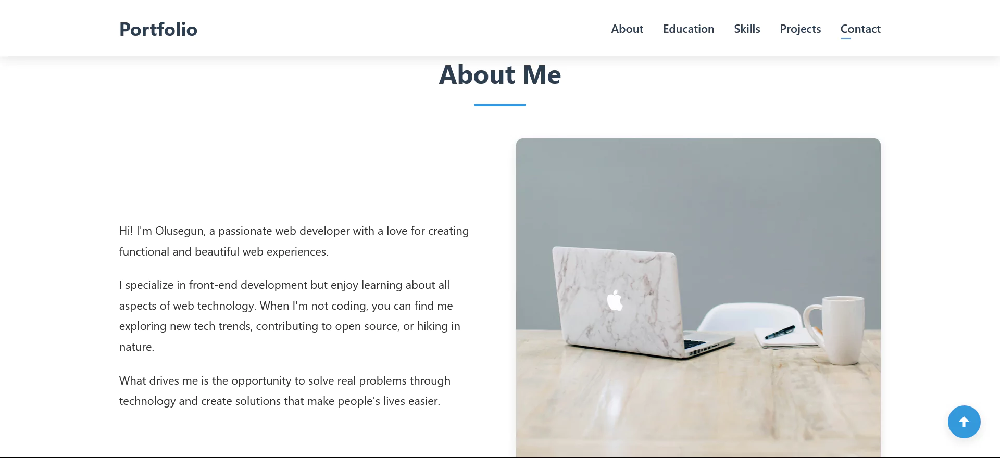
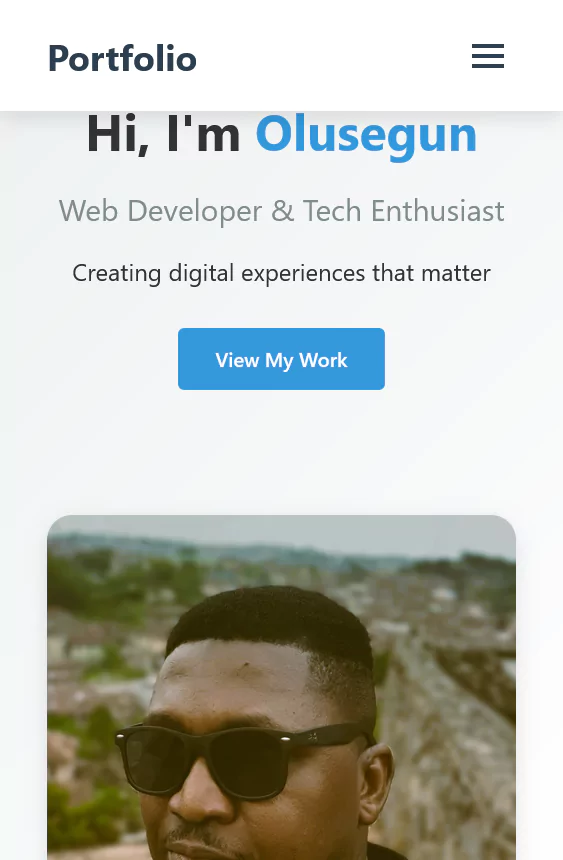
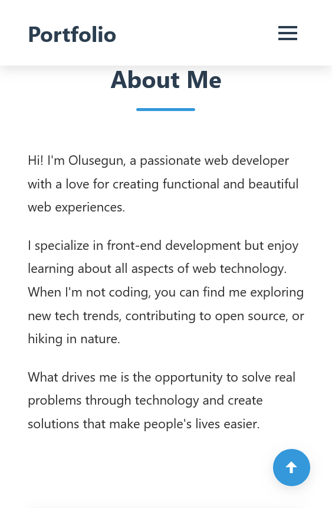

# My Portfolio Website 💼

A sleek, responsive portfolio website built with pure HTML and CSS (no frameworks or libraries).🚀

## Features

- Fully responsive design
- Clean, modern UI
- Sections for About, Education, Skills, Projects, and Contact
- Mobile-friendly navigation
- Downloadable CV
- Contact form

## Technologies Used

- HTML5
- CSS3 (with CSS variables for easy theming)
- Vanilla JavaScript for basic interactivity

## How to Use

1. Clone the repository
2. Open `index.html` in your browser
3. Customize the content with your own information

## Live Demo

[View the live demo on GitHub Pages](https://japhar1.github.io/plp-hackathon-1)

## Screenshots

## License

This project is open source and available under the [MIT License](LICENSE).
